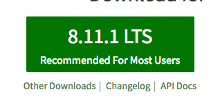
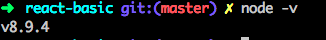
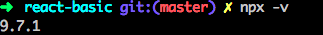

# React-Basic

### Install Node Js (กรณีที่ใครมีอยู่แล้วก็ข้ามขั้นตอนนี้ได้เลย)
`workshop ในครั้งนี้จะใช้ node js เป็นเบื้องหลังในการรัน React`
1. เข้าสู่เว็บ https://nodejs.org/en/
2. กดดาวน์โหลด  (เวอร์ชั่น 8 ขึ้นไปน่ะ)
   

3. ทำการ install
4. หากทำการติดตั้งสำเร็จ ให้ลองเปิด CMD
5. แล้วสั่งคำสั่ง `node -v` จะพบเลขเวอร์ชั่นของ node js
   

### Install NPX (execute npm package binaries)
1. สั่งคำสั่ง `npm install -g npx`
   

